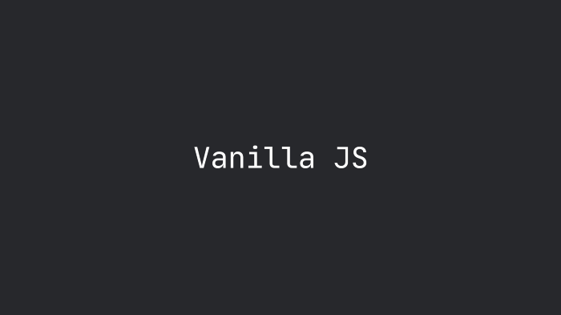

<h1 align="center">
    Vanilla JS all Week 
</h1>

<h4 align="center">
   Crete app with Vaniila JS all week  ☕
</h4>

  <a href="#uniplace-tecnologias">Tecnologias</a>&nbsp;&nbsp;&nbsp;|&nbsp;&nbsp;&nbsp;
  <a href="#-projeto">Projeto</a>&nbsp;&nbsp;&nbsp;|&nbsp;&nbsp;&nbsp;
  <a href="#-layout">Layout</a>&nbsp;&nbsp;&nbsp;|&nbsp;&nbsp;&nbsp;
  <a href="#-como-contribuir">Como contribuir</a>&nbsp;&nbsp;&nbsp;|&nbsp;&nbsp;&nbsp;
  <a href="#memo-licença">Licença</a>

 

 

## Technology 
* HTML5
* CSS3
* Vanilla JS

♥ by Hamilton Silva :wave: [Entre na nossa comunidade!](https://www.facebook.com/groups/2330277530393634)

## Redes Socias 
- [Facebook](https://www.facebook.com/tiohs.u)
- [Linkdin](https://www.linkedin.com/in/hamilton-silva-502355195/)
